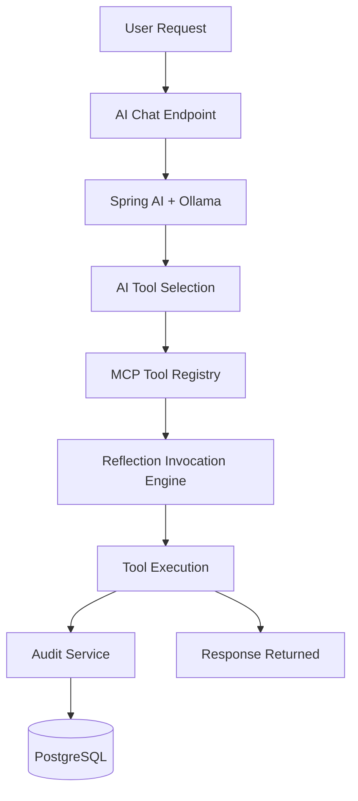
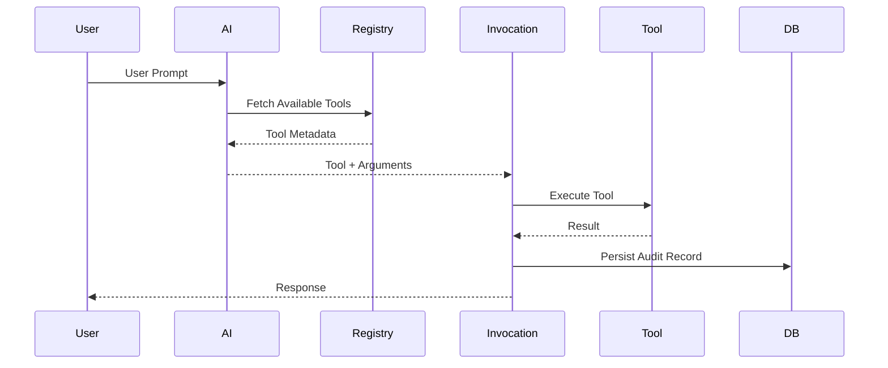
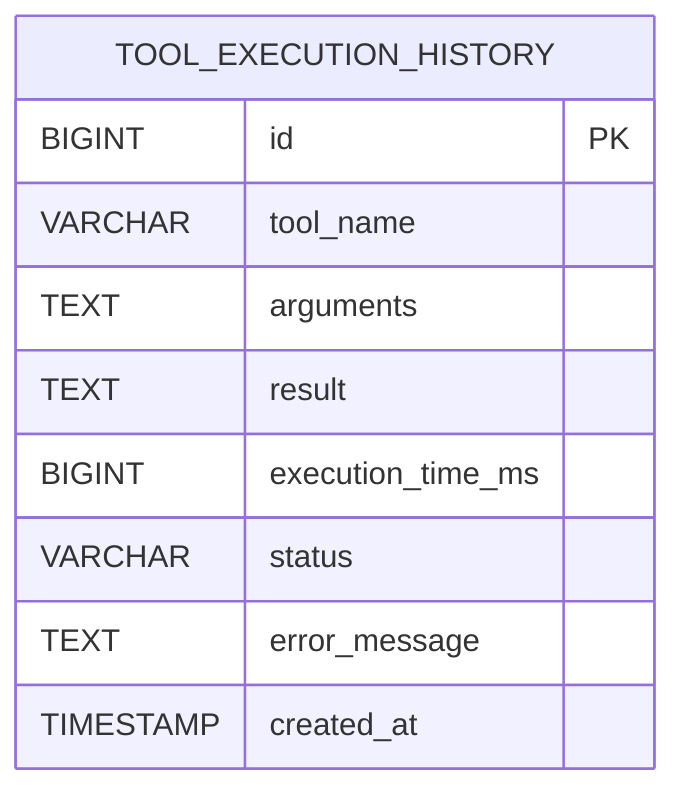

# 🚀 Spring AI MCP Starter

<div align="center">


### Build AI-powered MCP (Model Context Protocol) applications using Spring AI, Ollama, PostgreSQL, and annotation-driven tool orchestration.

</div>

---

# 📖 Overview

Spring AI MCP Starter is a modular Spring Boot framework that demonstrates how modern AI agent systems work internally.

It combines:

- Spring Boot Auto Configuration
- Spring AI
- Ollama Local LLMs
- Annotation Driven Tool Registration
- Reflection-Based Invocation
- PostgreSQL Audit Logging
- AI Tool Orchestration

The framework enables dynamic discovery, registration, invocation, and auditing of AI tools at runtime.

---

# ✨ Features

## Core Framework

- Custom `@McpTool` annotation
- Runtime tool discovery
- Dynamic tool registry
- Reflection-based tool invocation
- Spring Boot starter architecture
- Modular multi-module design
- Auto configuration support

## AI Features

- AI-powered tool selection
- Local LLM integration using Ollama
- Structured JSON tool orchestration
- Prompt-driven routing
- Dynamic runtime execution
- MCP-style workflow execution

## Persistence Features

- PostgreSQL integration
- Spring Data JPA
- Tool execution audit logging
- JSON argument persistence
- Execution time tracking
- Failure tracking
- Audit REST APIs

---

# 🏗️ High-Level Architecture



---

# 🔄 Runtime Flow



---

# 📦 Project Structure

```text
spring-ai-mcp-starter
│
├── spring-ai-mcp-core
│   ├── @McpTool Annotation
│   ├── Tool Registry
│   ├── DTOs
│   └── Contracts
│
├── spring-ai-mcp-autoconfigure
│   ├── Tool Scanner
│   ├── Invocation Engine
│   ├── Auto Configuration
│   ├── Audit Logging
│   ├── REST APIs
│   └── AI Tool Selection
│
├── spring-ai-mcp-spring-boot-starter
│   └── Starter Dependencies
│
└── samples/sample-chatbot
    ├── Weather Tool
    ├── Calculator Tool
    ├── AI Chat APIs
    └── Demo Application
```

---

# 🗄️ Database Schema



---

# ⚙️ Tech Stack

| Technology | Usage |
|------------|--------|
| Java 21 | Core Language |
| Spring Boot 3.5 | Application Framework |
| Spring AI | AI Abstraction Layer |
| Ollama | Local LLM Runtime |
| PostgreSQL | Persistence |
| Spring Data JPA | ORM Layer |
| Jackson | JSON Processing |
| Maven | Build System |
| Reflection API | Dynamic Invocation |

---

# 🚀 Available APIs

## Get Registered Tools

```http
GET /mcp/tools
```

---

## Invoke Tool

```http
POST /mcp/invoke
```

### Example Request

```json
{
  "toolName": "weather",
  "arguments": {
    "city": "Delhi"
  }
}
```

---

## Audit History

```http
GET /mcp/audit
```

### Example Response

```json
[
  {
    "id": 1,
    "toolName": "weather",
    "arguments": "{\"city\":\"Delhi\"}",
    "result": "Weather in Delhi",
    "executionTimeMs": 12,
    "status": "SUCCESS",
    "errorMessage": null,
    "createdAt": "2026-06-06T14:30:00"
  }
]
```

---

# 🤖 AI Chat Flow

```http
POST /ai/chat
```

Example:

```json
{
  "message": "What is weather in Delhi?"
}
```

Flow:

1. AI analyzes prompt
2. AI selects appropriate tool
3. AI generates arguments
4. Framework invokes tool dynamically
5. Result is returned
6. Audit record is persisted

---

# 🧩 Example MCP Tool

```java
@McpTool(
    name = "weather",
    description = "Get weather details"
)
public String getWeather(String city) {

    return "Weather in " + city;
}
```

---

# 🛠️ PostgreSQL Configuration

```yaml
spring:
  datasource:
    url: jdbc:postgresql://localhost:5432/mcp_db
    username: postgres
    password: ${DB_PASSWORD}

  jpa:
    hibernate:
      ddl-auto: update
```
---

# 📥 Installation

## Clone Repository

```bash
git clone https://github.com/gouravkheterpal/spring-ai-mcp-starter.git
```

## Build

```bash
mvn clean install
```

## Run

```bash
mvn spring-boot:run
```

---

# 🦙 Ollama Setup

Install Ollama:

https://ollama.com

Pull model:

```bash
ollama run gemma:2b
```

Verify:

```bash
ollama list
```

---

# 📊 Capability Matrix

| Capability | Status |
|------------|---------|
| Dynamic Tool Discovery | ✅ |
| Runtime Tool Registration | ✅ |
| Reflection Invocation | ✅ |
| Spring Boot Starter | ✅ |
| AI Tool Selection | ✅ |
| Ollama Integration | ✅ |
| PostgreSQL Integration | ✅ |
| Audit Logging | ✅ |
| Failure Tracking | ✅ |
| Audit REST API | ✅ |
| Conversation Memory | 🚧 |
| MCP Protocol Support | 🚧 |
| RAG Support | 🚧 |

---

# 🛣️ Roadmap

## Completed

- [x] Tool Registration
- [x] Tool Discovery
- [x] Reflection Invocation
- [x] Spring AI Integration
- [x] Ollama Integration
- [x] PostgreSQL Audit Logging
- [x] Failure Tracking
- [x] Audit APIs

## Planned

- [ ] Conversation Memory
- [ ] Tool Analytics Dashboard
- [ ] MCP Protocol Support
- [ ] Tool Chaining
- [ ] Multi-Step Agents
- [ ] RAG Integration
- [ ] Docker Compose Support
- [ ] Maven Central Publishing

---

# 🎯 Why This Project?

This project demonstrates enterprise-grade backend and AI engineering concepts:

- Spring Boot Starter Development
- Auto Configuration
- Reflection-based Framework Design
- AI Tool Orchestration
- MCP-style Runtime Execution
- PostgreSQL-backed Audit Logging
- Extensible Modular Architecture
- AI Agent Foundations

It serves as a foundation for:

- AI Agents
- MCP Servers
- Tool Orchestration Platforms
- Agentic Workflows
- AI Platform Engineering

---

# 👨‍💻 Author

## Gourav Kheterpal

Java Full Stack Developer

Focused on:

- Spring Boot
- Spring AI
- MCP Servers
- AI Agents
- React
- Distributed Systems

LinkedIn:

https://www.linkedin.com/in/gourav-kheterpal-758a65201/

---

# 📄 License

MIT License
